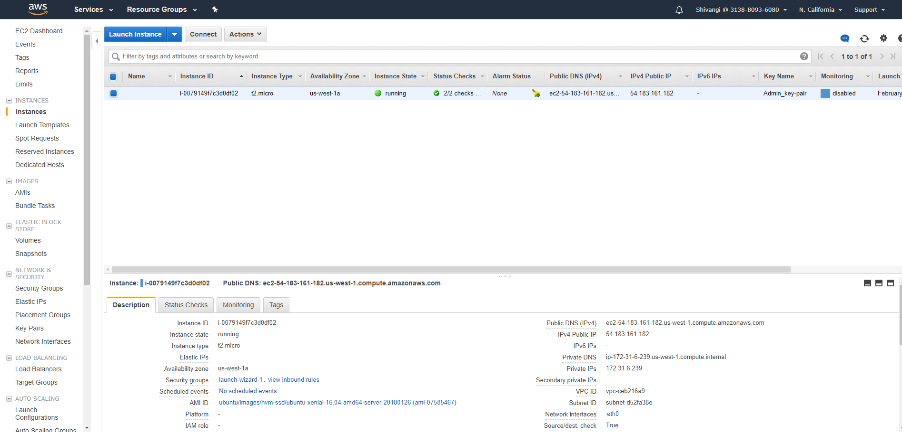
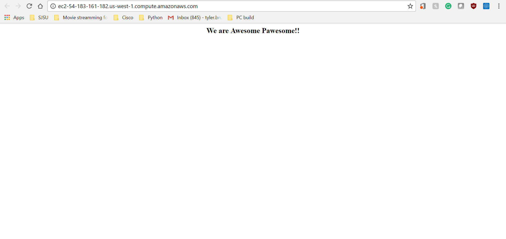
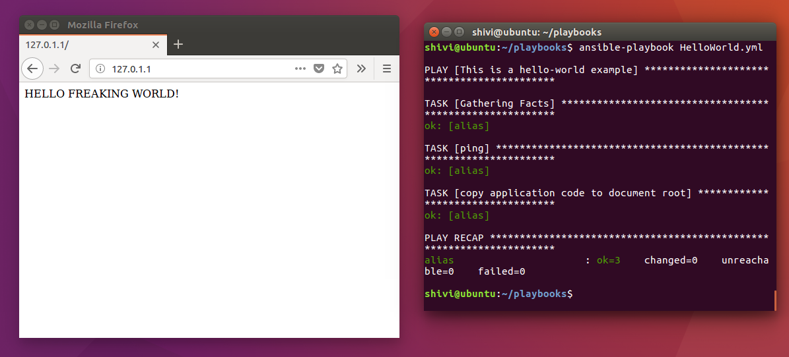

Shivangi Agarwal
Inderjit Bassi
Tyler Bruno
Lance Barrett
CMPE 172
Assignment 1: Ansible
Steps:
1.	Created localhost (127.0.0.1) to display “HELLO FREAKING WORLD”

2.	We created an AWS ec2 Instance on Http port 80. (http://ec2-54-183-161-182.us-west-1.compute.amazonaws.com/)

The following image is to show that the AWS instance is running.

3.	Our git hub link: https://github.com/tybruno/enterprise-172.git for all our files.